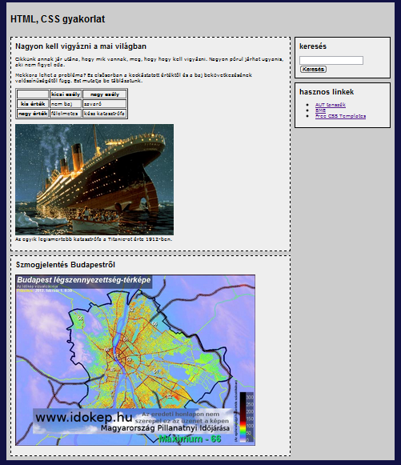
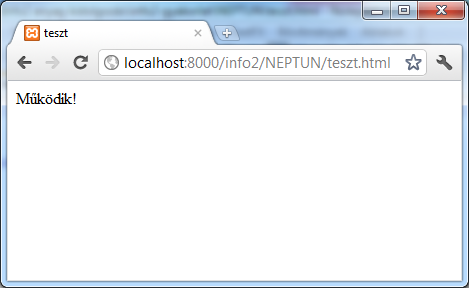
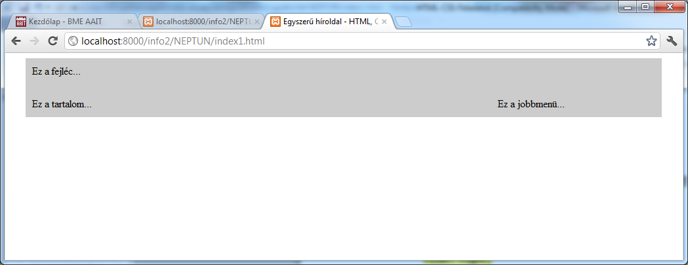
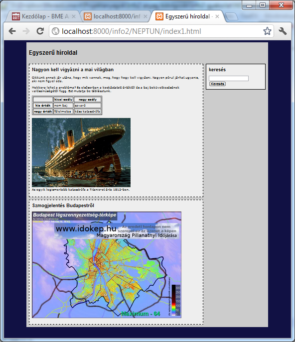

# HTML/CSS labor

## Felkészülés
A laborra felkészüléshez olvassa el a segédletet és próbáljon meg válaszolni az ellenőrző kérdésekre.

## Útmutató
Ebbe a könyvtárba készítse el a html/css labor megoldásait. A megoldásokat pull request formájában adja be a határidőre úgy, hogy reviewerként hozzárendeli a laborvezetőjét.
Figyeljen rá a labor elején, hogy hozzon létre egy új git branchet, mert a pull request létrehozásánal azt tudja majd a master ággal összehasonlítani.

Amennyiben a labor szöveges válaszokat kér kérdésekre, azokat a válaszokat ide írja be!

A feladatok elvégzésével a cél egy, az alábbi hasonló, összetett megoldásokat használó HTML oldal elkészítése.

A gyakorlat két közösen megoldott feladattal indul, a további feladatokat a hallgatók önállóan oldják meg.

## 1. Webszerver elindítása és egy tesztoldal elkészítése – vezetett

A gyakorlat során weboldalakat fogunk elkészíteni, melyeket böngészőben fogunk megnézni. A weboldalakat a böngészőknek a gépünkön futó Apache webszerver küldi el. Ez úgy van beállítva, hogy a weboldalakat a `D:\xampp\htdocs` mappában keresi, ezért a gyakorlat során ez alá a mappa alá fogjuk menteni a munkánkat.

- Készítsünk egy mappát a `D:\xampp\htdocs` mappa alá `info2` néven. A gyakorlat további részében ebbe a mappába fogunk dolgozni.
- Másoljuk be ebbe a mappába a `teszt.html` weboldalt.
- Indítsuk el az Apache webszervert.
- Nyissuk meg böngészőben a [http://localhost:8080/info2/teszt.html](http://localhost:8080/info2/teszt.html) címet (a port szám változó lehet, ezt ellenőrizzük az Apache webszerver elindításakor)

## 2. Egyszerű oldalelrendezés készítése HTML és CSS segítségével – vezetett

Ebben a feladatban egy fix szélességű, fejléccel és két hasábos elrendezéssel rendelkező oldal készítése a cél. A fejlécbe az oldal címe, a bal oldali hasábba a fő tartalma, a jobb oldali hasábba pedig segédanyagok fognak kerülni. Valahogy így:

Ezt a mai iparági gyakorlatnak megfelelően négy divvel fogjuk megvalósítani: egy-egy div kell a fejlécnek, a tartalomnak és a segédanyagoknak, valamint szükségünk lesz egy keret divre, ami tartalmazza az előző hármat. Ez a keret div szolgál arra, hogy az oldalnak fix szélességet adjon és középre rendezze a tartalmát.

### 2.1. Kéthasábos oldal struktúrájának kialakítása

Első lépésben a weboldal struktúráját készítjük el. Ennek a leírására a HTML nyelv szolgál.

- Készítsen el egy HTML dokumentumot, melynek címe (`title`) `Egyszerű híroldal - HTML, CSS gyakorlat.`
- Hozzon létre egy divet a dokumentum törzsében. Nevezze el a divet `keretnek` (állítsa be a `div` címke `id` attribútumát `keret` értékűre).
- Helyezzen el a keretben további három divet, rendre `fejlec`, `tartalom` és `jobbmenu` néven. A divekben helyezzen el szövegként a div nevét.
- A fenti három div után helyezzen el egy sortörés címkét (`br`), úgy hogy a `style` attribútuma `clear: both` értékű legyen – ennek szerepe az, hogy a dokumentum további részeiben megszűntesse a `tartalom` és `jobbmenu` divek folyó stílusának mellékhatásait, mely stílust egy későbbi feladatban fogjuk beállítani.
- Mentse el a dokumentumot `index.html` néven és nézze meg egy böngészőben (az oldal címe a laborgépeken valószínűleg [http://localhost:8080/info2/index.html](http://localhost:8080/info2/index.html) lesz):

### 2.2. Hasábok pozícionálása – az oldal megjelenésének beállítása

A második nagyobb lépésben szabályozni fogjuk, hogy a fenti három logikai egység (fejléc, tartalom, jobb-menü) hol jelenjen meg. A megjelenés szabályozására a CSS nyelv szolgál. Ezért készíteni fogunk egy CSS fájlt, amiben megadjuk a HTML dokumentumban található elemek helyét és stílusát. A HTML fájlt és CSS állományt pedig egy `link` kulcsszóval fogjuk összerendelni, melyet a HTML dokumentumban helyezünk el.

#### 2.2.1. CSS dokumentum létrehozása

- Hozzon létre egy új szöveges állományt `style.css` néven és mentse el az `index.html` mellé.
- Rendelje össze a style.css-t az index.html-lel: ehhez helyezzen el egy `link` taget a html dokumentum fejlécében. Ennek `rel` attribútumát állítsa `stylesheet`, `href` attribútumát pedig `style.css` értékűre.

- Hivatkozzon a CSS fájlban a `keret` nevű divre, és állítsa be
  - a szélességét 950 pixelre
  - a bal és jobb oldali margóját (`margin-left` és `margin-right`) `auto` értékűre – ez középre rendezi a divet
  - a belső margóját (`padding`) 10 pixelere
  - a hátérszínét (`background-color`) pedig valamilyen szürkére, például `#cccccc` értékűre.
- Hivatkozzon a CSS fájlban a `fejlec` nevű divre, és állítsa be a magasságát (`height`) 50 pixelre.
- Állítsa be a `tartalom` és `jobbmenu` nevű divek szélességét 700 illetve 240 pixelre.
- A tartalmat rendezze balra, a jobb-menüt pedig jobbra `float` tulajdonságuk `left` illetve `right` értékre állításával.
- Nézze meg az eredményt egy böngészőben:

Az oldal fix széességben, egy fejléccel és két hasábos elrendezéssel jelenik meg.

## 3. Cikkek készítése – önálló

Az oldal tartalmi részén cikkeket fogunk elhelyezni. Minden cikk egy darab második szintű címsorból (`h2`) és néhány bekezdésből (`p`) áll. Ezek logikailag összetartoznak (együtt alkotják a cikket), ezért egy közös `div` alatt fogjuk össze őket. Minden olyan divet, mely cikkeket tartalmaz egy közös osztályba sorolunk: a `class` attribútumuknak a `cikk` értéket állítjuk be.

### 3.1. Az első cikk elkészítése

- A tartalomnak kialakított helyre (a `tartalom` nevű divbe) illesszen be egy új `div`-et, és állítsa be annak `class` attribútumát `cikk` értékűre.
- A divben helyezzen el egy második szintű címsort (`h2` címke) valamilyen cím jellegű szöveggel (tipp: másoljon egy online hírújságból).
- A második szintű címsor alá tegyen be egy bekezdést (`p` címke) valamilyen hosszabb szöveggel (tipp: másoljon egy online hírújságból).

- Nézzük meg az eredményt böngészőben:

### 3.2. A cikkek stílusának beállítása

Készítsünk keretet, önálló háttérszínt és némi formázást a cikkeknek!

- Hivatkozzon a CSS állományban a HTML dokumentumban található `cikk` osztályra, és állítsa be a
  - keretet (`border`) 1 pixel vastag szaggatott fekete vonalra (`1px dashed black`),
  - a háttérszínt világosszürkére (például `#eeeeee` értékűre),
  - a belső margót (`padding`) 10 pixelesre,
  - a felső margót (`margin-top`) szintén 10 pixelesre.
- Nézze meg böngészőben az eredményt:

## 4. További tartalmi elemek elhelyezése az oldalon – önálló

- A fejléc tartalmát cserélje le egy első szintű címsorra (`h1`), például `Egyszerű híroldal` szöveggel.
- Helyezze el a mellékletben található képet (`img`) az első hír szövegében.
  - Másolja a `katasztrofa.jpg`-t az `index.html` mellé.
  - Állítsa be a kép `src` attribútumát a `katasztrofa.jpg` értékre.
  - Állítsa be a kép `title` és `alt` attribútumát úgy, hogy jól leírja mit ábrázol a kép – ezzel a vakok felolvasó szoftvereinek és a keresőmotoroknak segítünk.
- Helyezzen el fejléccel rendelkező 2x2-es táblázatot az első cikk szövegében. Ehhez használja a `table`, `tr`, `th`, `td` címkéket. (A táblázatnak keretet és belső vonalakat úgy adhatunk, ha CSS-ben a cellákra (`td`) beállítjuk a keret stílusát, vagy pedig használjuk a `table` `border` attribútumát).
- Az első cikk lemásolásával vagy utánzásával készítsen egy második cikket is.
- A második cikkben jelenítsen meg egy idegen szerveren található képet, melynek elérési útvonala (`url`): [http://m.cdn.blog.hu/gr/greenr/image/idokep/kep17.php.png](http://m.cdn.blog.hu/gr/greenr/image/idokep/kep17.php.png)
  - A kép szélességét (`width`) állítsa 600 pixelre
  - Töltse ki a `title` és `alt` attribútumokat értelem szerint
- Nézze meg böngészőben az eredményt:

## 5. Modulok készítése – opcionális

Ebben az opcionális feldataban egy keresőmodul fogunk készíteni. A modulok a cikkekhez hasonlóan nagyobb önálló egységek, ezért szintén divet használunk a megvalósításukra. A modulok divjeinek `class` attribútumát azonban `modul` értékűre fogjuk állítani.

- A jobb-menü hasábba illesszen egy `divet` és állítsa az osztályát (`class` attribútum) `modul` értékűre.
- A CSS állományban formázza meg a `modul` osztályt a `cikk` osztályhoz hasonlóan, de itt folytonos keret-stílust (`dashed` helyett `solid`) adjon meg.
- A modul divjében helyezzen ely egy második szintű címsor `Keresés` szöveggel.
- A címsor alá illesszen be egy HTML űrlapot (`form`).
- Az űrlapban helyezzen el szövegdobozt: ez egy `input` címke, ahol a `type` attribútum értéke `text`.
- A szövegdoboz után tegyen sortörést (`br`).
- Végül tegyem az űrlap aljára egy gombot: ez egy `input` címke, ahol a `type` attribútum értéke `submit`. A gomb feliratát a `value` attribútummal lehet szabályozni.
- Nézze meg az eredményt:

## 6. Az oldal alapstílusának beállítása – opcionális

Ebben az opcionális feladatban további stílusbeállításokat teszünk.

- A CSS állományban a teljes dokumentum tartalmára (`body`) írja elő a 12 pixeles `Verdana` betűtípus használatát – ezt a `font-family` és a `font-size` tulajdonságokkal lehet beállítani.
- A teljes tartalomra állítson be egy sötét háttérszínt (például: `#111144`).
- Az első és második szintű címsorok legyen `Arial` betűtípusúak.
- A második szintú címsor felső margóját (`margin-top`) vegye 0 pixelesre.

- Nézze meg az eredményt:

