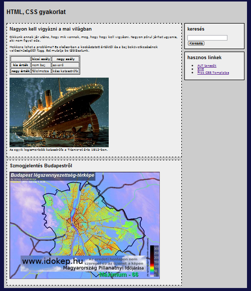
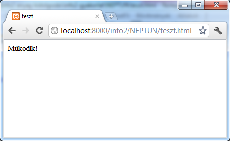
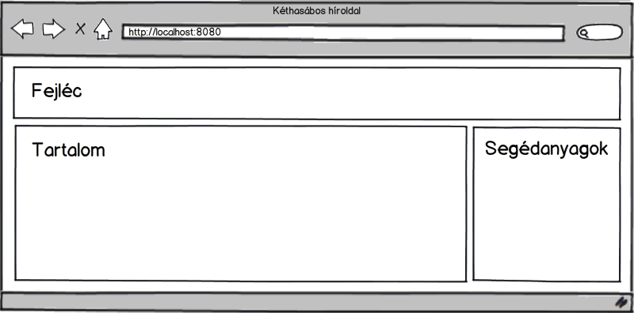
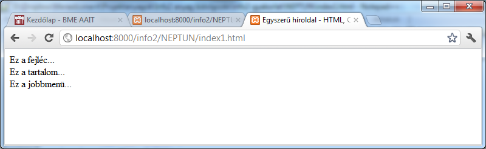
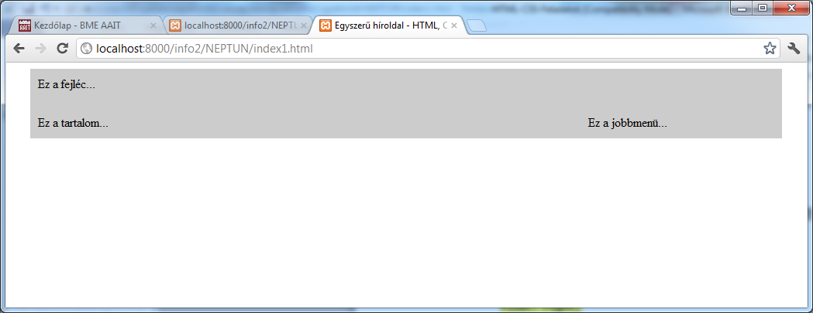
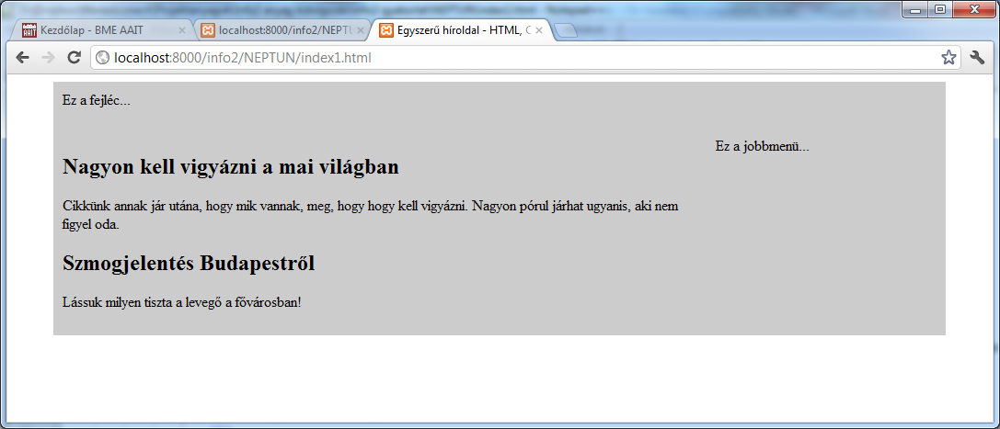
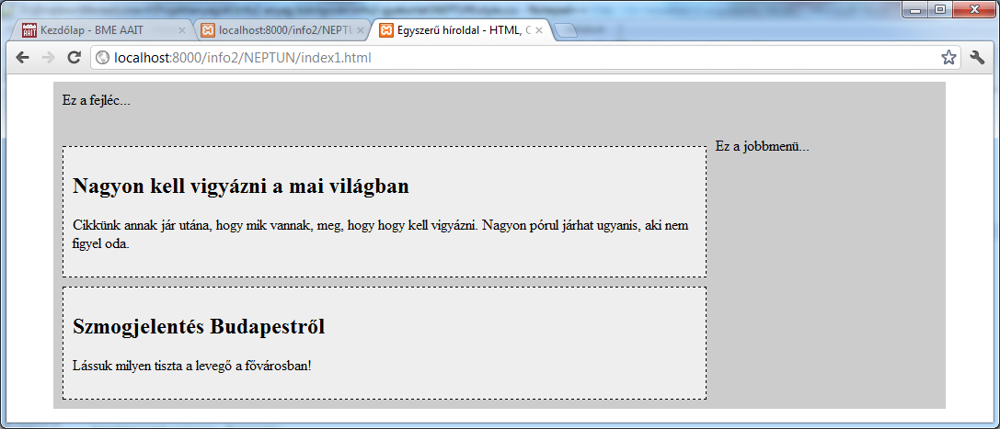
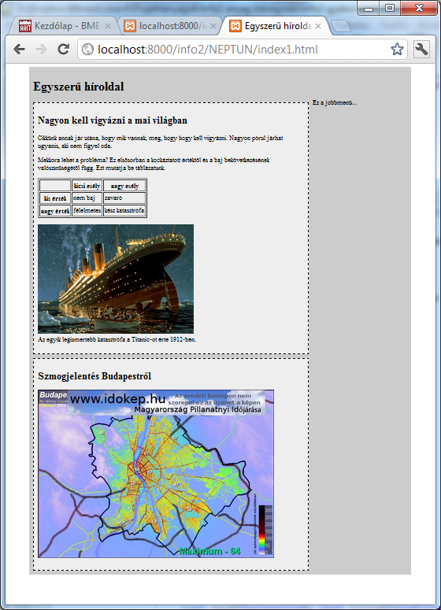
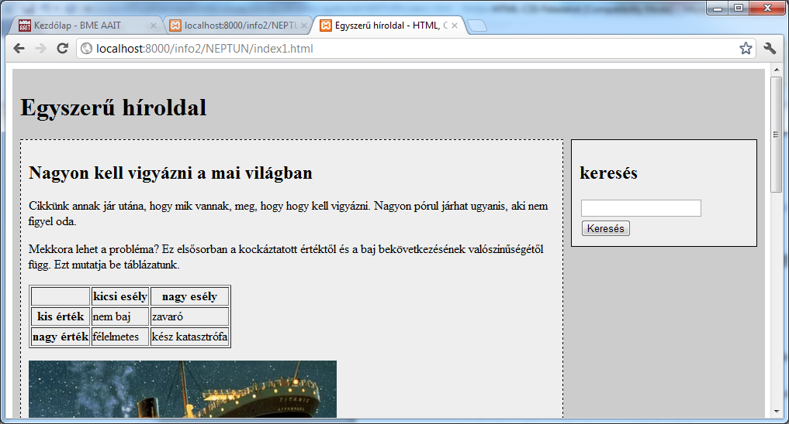
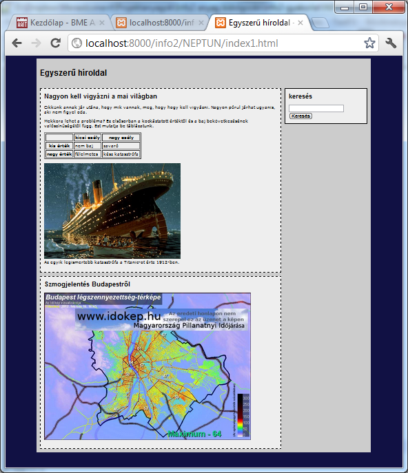

# HTML/CSS labor

## Felkészülés
A laborra felkészüléshez olvasd el a segédletet és próbáld meg megválaszolni az ellenőrző kérdéseket.

## A labor teljesítése
Ebbe a könyvtárba készítsd el a **html/css labor** megoldásait. A feladatok elvégzésével a cél egy, az alábbi hasonló, összetett megoldásokat használó HTML oldal elkészítése. 

A labor teljesítéséhez a jelenléten felül az 1-4 feladatok elkészítésére van szükség. A gyakorlat két közösen megoldott feladattal indul, a további feladatokat önállóan kell megoldani.

> [!IMPORTANT]
> A megoldásokat pull request formájában kell beadni a határidő előtt a Moodle alatt található **Git tudnivalók** leírásban található utasítások alapján.
> - Hozz létre egy **új branchet** `megoldas` néven, és ezen dolgozz.
> - Töltsd ki a `neptun.txt` fájlt a saját Neptun kódoddal.
> - Minden feladat után kommitolj, és használj értelmes kommit üzeneteket.
> - A feladat végeztével vagy a labor végén **pushold** a megoldásodat és hozz létre egy **pull requestet**.
> - Ellenőrizd a pull request tartalmát és rendeld hozzá a laborvezetődet **reviewernek**.

> [!CAUTION]
> A nem ilyen formában megadott megoldások nem lesznek értékelve!

## 1. Webszerver elindítása és egy tesztoldal elkészítése

A gyakorlat során weboldalakat fogunk elkészíteni, melyeket böngészőben fogunk megnézni. A weboldalakat a böngészőknek a gépünkön futó Apache webszerver küldi el. A webszerver elindításához az XAMPP szoftvert fogjuk használni, ami úgy van beállítva, hogy a weboldalakat a szoftver telepítési mappájában található `htdocs` mappában keresi, ezért a gyakorlat során ez alá a mappa alá fogjuk menteni a munkánkat.

- Nyissuk meg az XAMPP programot és indítsuk el az Apache webszervert.

> [!NOTE]
> Laborgépeken az XAMPP szoftvert a `C:/Tools/xampp/xampp-control.exe` állománnyal tudjuk elindítani.

- Keressük meg a `htdocs` mappát (`C:\Tools\xampp\htdocs`) és vegyünk fel egy új mappát a Neptun kódunkkal. 
- Klónozzuk le a repository-t ebbe a mappába. A gyakorlat további részében ebbe a mappában fogunk dolgozni.
- Nyissuk meg böngészőben a [http://localhost:8080/<neptun>](http://localhost:8080/<neptun>) címet.

> [!NOTE]
> A webszerver portjának száma változó lehet, ezt ellenőrizzük az Apache webszerver elindításakor.

- Navigáljunk el a repoban található `index.html` fájlhoz.

### :bookmark_tabs: Beadandó

- [ ] Hozz létre egy képernyőképet az oldal tartalmáról! Ügyelj rá, hogy a böngésző címsora is jól látható legyen a képen. 
- [ ] Mentsd el a képet `feladat-1.png` néven a repository gyökerébe.
- [ ] Kommitold a változtatásokat.

## 2. Egyszerű oldalelrendezés készítése HTML és CSS segítségével

Ebben a feladatban egy fix szélességű, fejléccel és két hasábos elrendezéssel rendelkező oldal készítése a cél. A fejlécbe az oldal címe, a bal oldali hasábba a fő tartalma, a jobb oldali hasábba pedig segédanyagok fognak kerülni. Valahogy így:

Ezt négy divvel fogjuk megvalósítani: egy-egy div kell a fejlécnek, a tartalomnak és a segédanyagoknak, valamint szükségünk lesz egy keret divre, ami tartalmazza az előző hármat. Ez a keret div szolgál arra, hogy az oldalnak fix szélességet adjon és középre rendezze a tartalmát.

### Kéthasábos oldal struktúrájának kialakítása

Első lépésben a weboldal struktúráját készítjük el. Ennek a leírására a HTML nyelv szolgál.

- Add meg a weboldal címét (`title`) ami legyen `Egyszerű híroldal - HTML, CSS gyakorlat.`.
- Hozz létre egy divet a dokumentum törzsében. Nevezd el a divet `keretnek` (állítsa be a `div` címke `id` attribútumát `keret` értékűre).
- Helyezz el a keretben további három divet, rendre `fejlec`, `tartalom` és `jobbmenu` néven. A divekben helyezd el szövegként a div nevét.
- A fenti három div után helyezz el egy sortörés címkét (`br`), úgy hogy a `style` attribútuma `clear: both` értékű legyen – ennek szerepe az, hogy a dokumentum további részeiben megszűntesse a `tartalom` és `jobbmenu` divek folyó stílusának mellékhatásait, mely stílust egy későbbi feladatban fogjuk beállítani.

### Hasábok pozícionálása – az oldal megjelenésének beállítása

A második nagyobb lépésben szabályozni fogjuk, hogy a fenti három logikai egység (fejléc, tartalom, jobb-menü) hol jelenjen meg. A megjelenés szabályozására a CSS nyelv szolgál. Ezért készíteni fogunk egy CSS fájlt, amiben megadjuk a HTML dokumentumban található elemek helyét és stílusát. A HTML fájlt és CSS állományt pedig egy `link` kulcsszóval fogjuk összerendelni, melyet a HTML dokumentumban helyezünk el.

- Hozz létre egy új szöveges állományt `style.css` néven és mentsd el az `index.html` mellé.
- Rendeld össze a `style.css`-t az `index.html`-lel: ehhez helyezz el egy `link` taget a html dokumentum fejlécében. Ennek `rel` attribútumát állítsd `stylesheet`, `href` attribútumát pedig `style.css` értékűre.
- Hivatkozz a CSS fájlban a `keret` nevű divre, és állítsd be:
  - a szélességét 950 pixelre,
  - a bal és jobb oldali margóját (`margin-left` és `margin-right`) `auto` értékűre – ez középre rendezi a divet,
  - a belső margóját (`padding`) 10 pixelere,
  - a hátérszínét (`background-color`) pedig valamilyen szürkére, például `#cccccc` értékűre.
- Hivatkozz a CSS fájlban a `fejlec` nevű divre, és állítsd be a magasságát (`height`) 50 pixelre.
- Állítsd be a `tartalom` és `jobbmenu` nevű divek szélességét 700 illetve 240 pixelre.
- A tartalmat rendezzd balra, a jobb-menüt pedig jobbra `float` tulajdonságuk `left` illetve `right` értékre állításával.
- Nézd meg az eredményt egy böngészőben.

### :bookmark_tabs: Beadandó

- [ ] Hozz létre egy képernyőképet az oldal tartalmáról! Ügyelj rá, hogy a böngésző címsora is jól látható legyen a képen. 
- [ ] Mentsd el a képet `feladat-2.png` néven a repository gyökerébe.
- [ ] Kommitold a változtatásokat.

## 3. Cikkek készítése

Az oldal tartalmi részén cikkeket fogunk elhelyezni. Minden cikk egy darab második szintű címsorból (`h2`) és néhány bekezdésből (`p`) áll. Ezek logikailag összetartoznak (együtt alkotják a cikket), ezért egy közös `div` alatt fogjuk össze őket. Minden olyan divet, mely cikkeket tartalmaz egy közös osztályba sorolunk: a `class` attribútumuknak a `cikk` értéket állítjuk be.

### Az első cikk elkészítése

- A tartalomnak kialakított helyre (a `tartalom` nevű divbe) illessz be egy új `div`-et, és állítsd be annak `class` attribútumát `cikk` értékűre.
- A divben helyezz el egy második szintű címsort (`h2` címke) valamilyen cím jellegű szöveggel.
- A második szintű címsor alá tegyél be egy bekezdést (`p` címke) valamilyen hosszabb szöveggel.

> [!TIP]
> Másolj egy online hírújságból!

### A cikkek stílusának beállítása

Készítsünk keretet, önálló háttérszínt és némi formázást a cikkeknek.

- Hivatkozz a CSS állományban a HTML dokumentumban található `cikk` osztályra, és állítsd be a
  - keretet (`border`) 1 pixel vastag szaggatott fekete vonalra (`1px dashed black`),
  - a háttérszínt világosszürkére (például `#eeeeee` értékűre),
  - a belső margót (`padding`) 10 pixelesre,
  - a felső margót (`margin-top`) szintén 10 pixelesre.
- Nézd meg böngészőben az eredményt.

### :bookmark_tabs: Beadandó

- [ ] Hozz létre egy képernyőképet az oldal tartalmáról! Ügyelj rá, hogy a böngésző címsora is jól látható legyen a képen. 
- [ ] Mentsd el a képet `feladat-3.png` néven a repository gyökerébe.
- [ ] Kommitold a változtatásokat.

## 4. További tartalmi elemek elhelyezése az oldalon

- A fejléc tartalmát cseréld le egy első szintű címsorra (`h1`), például `Egyszerű híroldal` szöveggel.
- Helyezd el a mellékletben található képet (`img`) az első hír szövegében.
  - Állítsd be a kép `src` attribútumát a `katasztrofa.jpg` értékre.
  - Állítsd be a kép `title` és `alt` attribútumát úgy, hogy jól leírja mit ábrázol a kép – ezzel a vakok felolvasó szoftvereinek és a keresőmotoroknak segítünk.
- Helyezz el fejléccel rendelkező 3x3-es táblázatot az első cikk szövegében. Ehhez használd a `table`, `tr`, `th`, `td` címkéket. (A táblázatnak keretet és belső vonalakat úgy adhatunk, ha CSS-ben a cellákra (`td`) beállítjuk a keret stílusát, vagy pedig használjuk a `table` `border` attribútumát).
- Az első cikk lemásolásával vagy utánzásával készíts egy második cikket is.
- A második cikkben jelenítsd meg egy idegen szerveren található képet, melynek elérési útvonala (`url`): [http://m.cdn.blog.hu/gr/greenr/image/idokep/kep17.php.png](http://m.cdn.blog.hu/gr/greenr/image/idokep/kep17.php.png).
  - A kép szélességét (`width`) állítsd 600 pixelre.
  - Töltsd ki a `title` és `alt` attribútumokat értelem szerűen.
- Nézd meg böngészőben az eredményt.

### :bookmark_tabs: Beadandó

- [ ] Hozz létre egy képernyőképet az oldal tartalmáról! Ügyelj rá, hogy a böngésző címsora is jól látható legyen a képen. 
- [ ] Mentsd el a képet `feladat-4.png` néven a repository gyökerébe.
- [ ] Kommitold a változtatásokat.

## 5. További opcionális feladatok

### Modulok készítése

Ebben az opcionális feldataban egy keresőmodult fogunk készíteni. A modulok a cikkekhez hasonlóan nagyobb önálló egységek, ezért szintén divet használunk a megvalósításukra. A modulok divjeinek `class` attribútumát azonban `modul` értékűre fogjuk állítani.

- A jobb-menü hasábba illessz egy `divet` és állítsd az osztályát (`class` attribútum) `modul` értékűre.
- A CSS állományban formázd meg a `modul` osztályt a `cikk` osztályhoz hasonlóan, de itt folytonos keret-stílust (`dashed` helyett `solid`) adj meg.
- A modul divjében helyezz el egy második szintű címsor `Keresés` szöveggel.
- A címsor alá illessz be egy HTML űrlapot (`form`).
- Az űrlapban helyezz el egy szövegdobozt: ez egy `input` címke, ahol a `type` attribútum értéke `text`.
- A szövegdoboz után tegyél sortörést (`br`).
- Végül tegyél az űrlap aljára egy gombot: ez egy `input` címke, ahol a `type` attribútum értéke `submit`. A gomb feliratát a `value` attribútummal lehet szabályozni.
- Nézd meg az eredményt a böngészőben.

### Az oldal alapstílusának beállítása

Ebben az opcionális feladatban további stílusbeállításokat teszünk.

- A CSS állományban a teljes dokumentum tartalmára (`body`) írja elő a 12 pixeles `Verdana` betűtípus használatát – ezt a `font-family` és a `font-size` tulajdonságokkal lehet beállítani.
- A teljes tartalomra állíts be egy sötét háttérszínt (például: `#111144`).
- Az első és második szintű címsorok legyen `Arial` betűtípusúak.
- A második szintú címsor felső margóját (`margin-top`) vedd 0 pixelesre.
- Nézd meg az eredményt a böngészőben.

### :bookmark_tabs: Beadandó - opcionális

- [ ] Hozz létre egy képernyőképet az oldal tartalmáról! Ügyelj rá, hogy a böngésző címsora is jól látható legyen a képen. 
- [ ] Mentsd el a képet `feladat-4.png` néven a repository gyökerébe.
- [ ] Kommitold a változtatásokat.
